# Tech-blog


## Description

This project required the creation of a CMS-style blog site, where users can write and publish blogs posts as well as comment on other blog posts.

It was required that the application followed the MVC paradigm in its architectural structure, used Handlebars.js as the templating language, used Sequelize as the ORM, and used the express-session npm package for authentication.

> The deployed application can be viewed at: https://pacific-dusk-52662.herokuapp.com/

## Table of contents
- [User story](#user-story)
- [Acceptance criteria](#acceptance-criteria)
- [Technologies used/built with](#technologies-usedbuilt-with)
- [Installation](#installation)
- [Usage](#usage)
- [Credits](#credits)
- [License](#license)

## User story

```
AS A developer who writes about tech
I WANT a CMS-style blog site
SO THAT I can publish articles, blog posts, and my thoughts and opinions
```

## Acceptance criteria

```
GIVEN a CMS-style blog site
WHEN I visit the site for the first time
THEN I am presented with the homepage, which includes existing blog posts if any have been posted; navigation links for the homepage and the dashboard; and the option to log in
WHEN I click on the homepage option
THEN I am taken to the homepage
WHEN I click on any other links in the navigation
THEN I am prompted to either sign up or sign in
WHEN I choose to sign up
THEN I am prompted to create a username and password
WHEN I click on the sign-up button
THEN my user credentials are saved and I am logged into the site
WHEN I revisit the site at a later time and choose to sign in
THEN I am prompted to enter my username and password
WHEN I am signed in to the site
THEN I see navigation links for the homepage, the dashboard, and the option to log out
WHEN I click on the homepage option in the navigation
THEN I am taken to the homepage and presented with existing blog posts that include the post title and the date created
WHEN I click on an existing blog post
THEN I am presented with the post title, contents, post creator’s username, and date created for that post and have the option to leave a comment
WHEN I enter a comment and click on the submit button while signed in
THEN the comment is saved and the post is updated to display the comment, the comment creator’s username, and the date created
WHEN I click on the dashboard option in the navigation
THEN I am taken to the dashboard and presented with any blog posts I have already created and the option to add a new blog post
WHEN I click on the button to add a new blog post
THEN I am prompted to enter both a title and contents for my blog post
WHEN I click on the button to create a new blog post
THEN the title and contents of my post are saved and I am taken back to an updated dashboard with my new blog post
WHEN I click on one of my existing posts in the dashboard
THEN I am able to delete or update my post and taken back to an updated dashboard
WHEN I click on the logout option in the navigation
THEN I am signed out of the site
WHEN I am idle on the site for more than a set time
THEN I am able to view comments but I am prompted to log in again before I can add, update, or delete comments
```

## Technologies used/built with

This project used the following technologies to build it:

- JavaScript
- CSS
- HTML
- [Bootstrap](https://getbootstrap.com/)
- [Google Fonts](https://fonts.google.com/)
- [Node.js](https://nodejs.org/en/)
- [Express.js](https://expressjs.com/)
- [Sequelize NPM package](https://sequelize.org/)
- [MySQL2 NPM package](https://www.npmjs.com/package/mysql2)
- [dotenv NPM package](https://www.npmjs.com/package/dotenv)
- [bcrypt NPM package](https://www.npmjs.com/package/bcrypt)
- [connect-session-sequelize NPM package](https://www.npmjs.com/package/connect-session-sequelize)
- [Handlebars.js](https://handlebarsjs.com/)
- [express-handlebars NPM package](https://www.npmjs.com/package/express-handlebars)
- [express-session NPM package](https://www.npmjs.com/package/express-session)

## Installation

1. Clone the repo (HTTPS: `git clone https://github.com/CharDige/Tech-blog.git` or SSH: `git clone git@github.com:CharDige/Tech-blog.git`)

2. Install all NPM packages by running `npm i` in the command-line. Or, if you wish to install each NPM package individually:

- Install Express.js NPM package `npm install express`
- Install Sequelize NPM package `npm install sequelize`
- Install MySQL2 NPM package `npm install mysql2`
- Install dotenv NPM package `npm install dotenv`
- Install bcrypt NPM package `npm install bcrypt`
- Install connect-session-sequelize NPM package `npm install connect-session-sequelize`
- Install express-handlebars NPM package `npm install express-handlebars`
- Install express-session NPM package `npm install express-session`

## Usage

Below, you will find screenshots of the deployed application in use.

> You can also view the deployed application at https://pacific-dusk-52662.herokuapp.com/

When the application is first opened, the user is greeted by the homepage, which is a list of all the current blog posts by all users on the application.

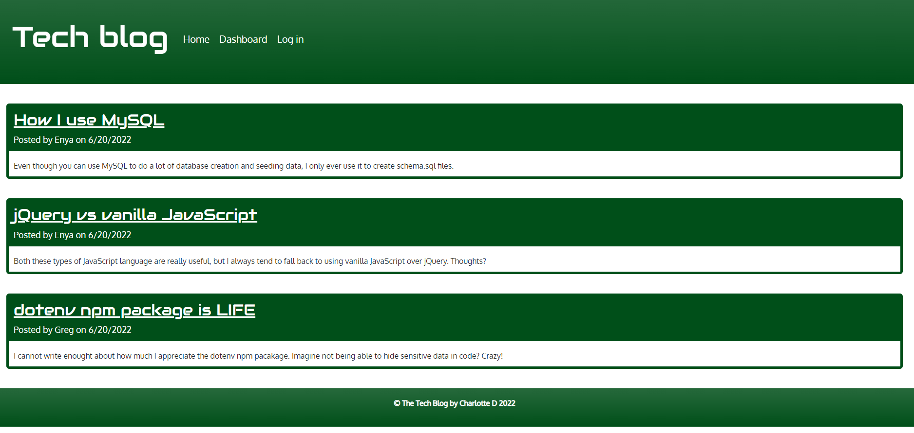

Whether a user is logged in or not, they will be able to click on the blog posts and read them in their entirety. However, only logged in users will be able to submit comments, whereas users who aren't logged in can try and submit a comment but none will appear.

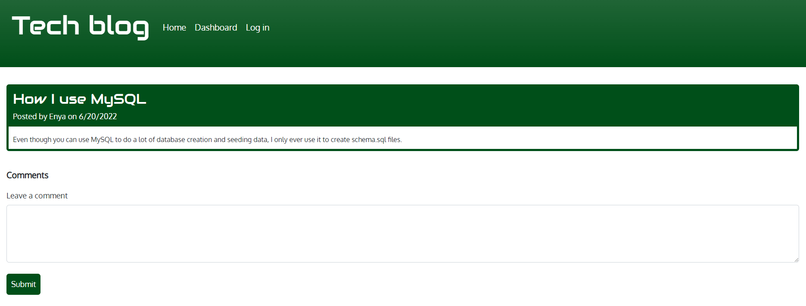

If the user clicks on `dashboard` in the navigation, they will be prompted to log in or sign up (if they aren't already). The user can also click on "log in" to log in or sign up to the application.

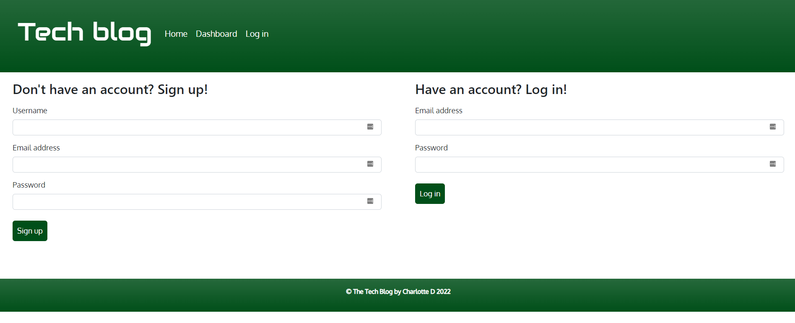

Once the user logs in or signs up, they will be presented with the `dashboard`, which presents the user with all their past blog posts (if they have published any) and a button prompting users to create a new blog post. Each blog post will also have a delete button on it, in case the user wants to remove it from the application.

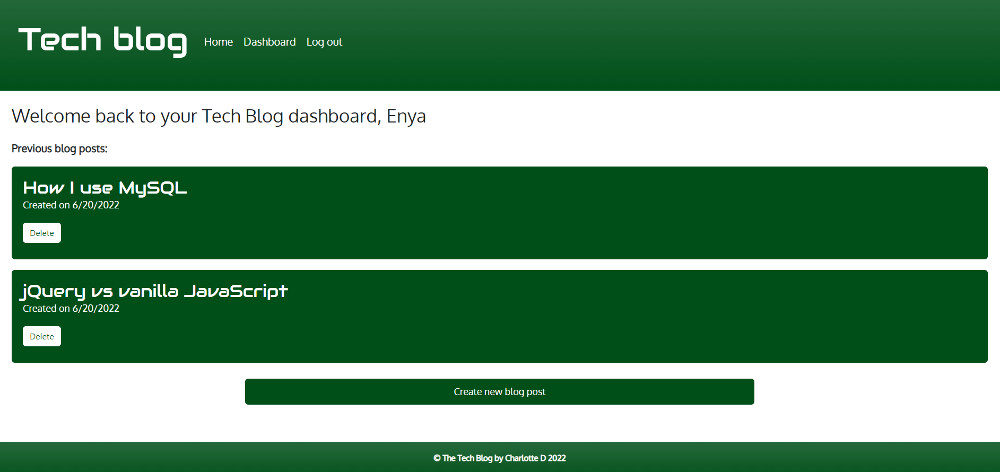

If the user clicks on "create new blog post", they will be presented with a form asking for a title and the contents of the blog post. Then, they can submit the form, which will create the new post.

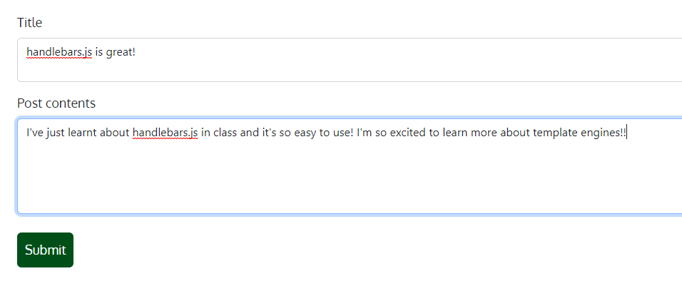

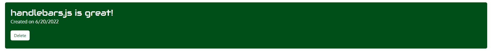

The user will also be able to update previous blog posts by clicking on the blog post title. This will then take the user to a similar form as when they created the blog post. However, the form will already be filled out with the current content. The user can then update the content as they need to and click 'update'.

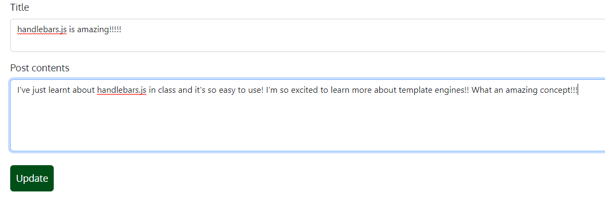

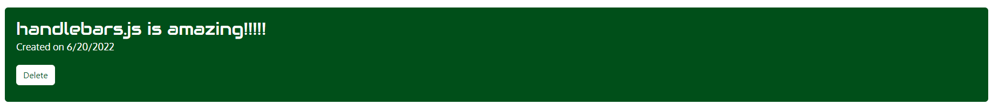

Logged in users can also post comments on blog posts, as mentioned earlier in this README. This can be done by either clicking on "Tech blog" or the "home" option in the navigation, then clicking on any of the blog posts listed.

Once the logged in user is in the blog post, they can enter their comment in the input area and submit it. The comment will then appear, including details of the user who posted the comment and the date. And, there will also be an option for the user to delete the comment.

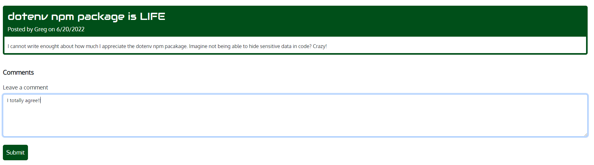

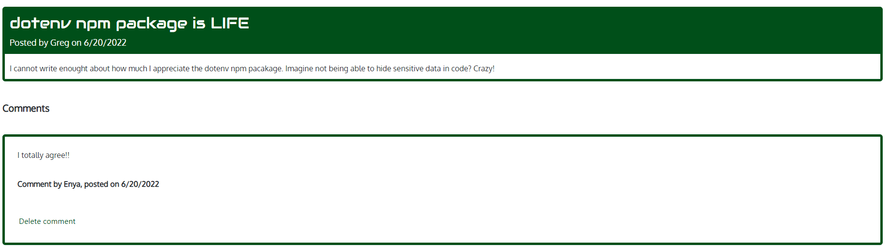

Once the user is finished with what they wanted to do on the application, they can then log out by clicking on the 'log out' option in the navigation.

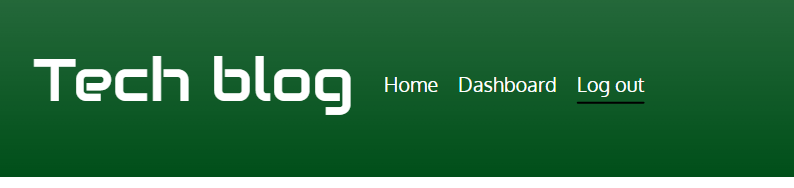

## Credits

Here's a list of resources I'd like to credit that really helped with the development of this application:

- [W3 Schools - JavaScript Date toLocaleDateString()](https://www.w3schools.com/jsref/jsref_tolocaledatestring.asp)
- [W3 Schools - JavaScript HTML DOM EventListener](https://www.w3schools.com/js/js_htmldom_eventlistener.asp)
- [mdn web docs - EventTarget.addEventListener()](https://developer.mozilla.org/en-US/docs/Web/API/EventTarget/addEventListener)
- [Handlebars - Partials](https://handlebarsjs.com/guide/partials.html)
- [W3 Schools - JavaScript Window Location](https://www.w3schools.com/js/js_window_location.asp?output=printPagePage)

## License

[MIT License - Copyright (C) 2022 Charlotte Dige](./LICENSE)